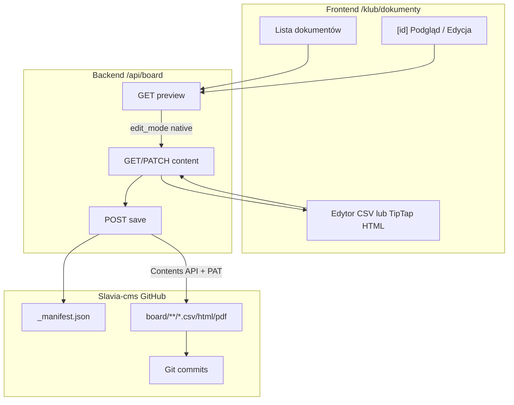
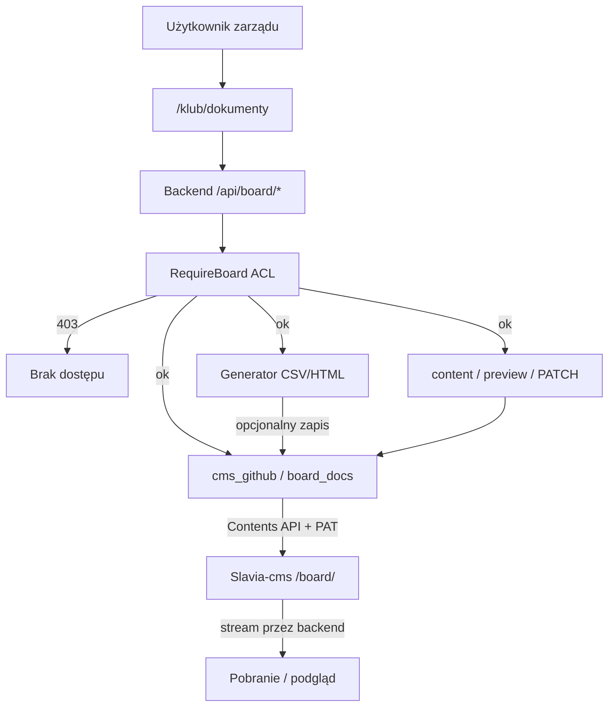

## Założenia (z Twoich odpowiedzi)
- Konto „członka zarządu” ma dostęp do sekcji w panelu klubu (`/klub`), która przechowuje dokumenty klubu i ma generator.
- Są dwa poziomy uprawnień w obrębie zarządu:
  - „prezes/wice” (pełne uprawnienia): może zapisywać/wersjonować dokumenty w repozytorium oraz generować m.in. listy startowe.
  - „pozostali członkowie zarządu”: mogą generować dokumenty podstawowe (np. raporty na zebrania + dokumenty dostępne „dla każdego”), ale bez zapisywania/wersjonowania repozytorium.
- Superadmin: dostęp do wszystkiego.

## Decyzja architektoniczna: Slavia-cms zamiast Google Drive

**Repozytorium dokumentów zarządu = folder `board/` w istniejącym repo [Slavia-cms](https://github.com/JakubGawron1/Slavia-cms)** (ten sam GitHub co media galerii/bloga, ale **osobna przestrzeń ścieżek** i **inna polityka dostępu**).

| Aspekt | Media klubowe (`media/`) | Dokumenty zarządu (`board/`) |
|--------|--------------------------|------------------------------|
| Widoczność | Publiczne URL (`NUXT_PUBLIC_CMS_BASE_URL`) | **Tylko proxy backendu** (PAT + ACL JWT) |
| Integracja | `cms_github.rs` — upload/delete | Rozszerzenie tego modułu — read/write/list/history |
| Repo | `SLAVIA_CMS_REPO` | Ten sam repo, root `SLAVIA_BOARD_DOCS_ROOT` (domyślnie `board`) |
| Auth GitHub | `GITHUB_TOKEN` (scope `repo` przy prywatnym repo) | Ten sam PAT |

**Dlaczego nie Google Drive:** jeden stack (Git + PAT już na produkcji), wersjonowanie natywne (commity Git), brak service account Google, spójność z mediami klubowymi w jednym repo.

**Dlaczego nie publiczny raw URL dla `board/`:** dokumenty zarządu (finanse, kadry, RODO) muszą być chronione — backend nigdy nie zwraca klientowi bezpośredniego linku `raw.githubusercontent.com` do plików z `board/`.

## Proponowany model techniczny
- W backendzie dodajemy nowe role w JWT/DB:
  - rola bazowa: `BoardMember` (członek zarządu)
  - dodatkowa rola/flag: `BoardDocsFullAccess` (pełne zarządzanie repozytorium i generatorami startowymi)
- Na potrzeby frontendowego panelu dodajemy nowy „panel role” `board` (osobny zestaw modułów w katalogu panelu), ale zabezpieczenia finalnie egzekwujemy po stronie backendu (HTTP 403).

## Struktura w repozytorium Slavia-cms

```
Slavia-cms/  (repo — może być prywatne)
  media/                          # istniejące — galeria, blog, ogłoszenia (publiczne)
    gallery/
    blog/
    announcements/
  board/                          # NOWE — dokumenty zarządu (prywatne, tylko przez API)
    _manifest.json                # indeks: lista dokumentów + metadane + app_versions + doc_type
    athletes/                     # dokumenty zawodników
    coaches/                      # dokumenty trenerskie
    competitions/                 # zawody (regulaminy, protokoły…)
    start-lists/                  # listy startowe (generator)
    equipment/                    # sprzęt
    meeting-reports/              # raporty / protokoły zarządu (generator)
    organizational/               # statut, uchwały, regulaminy
    financial/                    # składki, faktury, dotacje
    hr/                           # kadry, BHP
    legal/                        # RODO, ubezpieczenia
    marketing/                    # promocja, wizerunek
    templates/                    # szablony HTML/CSV (szkielet do podglądu i edycji)
    archive/                      # archiwum (opcjonalnie)
```

**Katalog typów dokumentów (V1):**
- ~55 wbudowanych typów w `app/data/boardDocumentCatalog.ts` (sport: zawodnicy, trenerzy, zawody, sprzęt; zarząd: organizacyjne, finansowe, kadrowe, prawne, marketing).
- Strona `/klub/dokumenty/typy` — przegląd katalogu + dodawanie typów własnych (`custom_*`; prototyp: localStorage → docelowo zapis w `_manifest.json` przez API).
- Pole `doc_type` w `_manifest.json` odnosi się do id typu z katalogu.

**Wersjonowanie (Git + manifest):**
- **Git (natywne):** każdy zapis przez Contents API = commit na gałęzi `SLAVIA_CMS_BRANCH` (domyślnie `main`); historia przez GitHub Commits API / listę SHA z manifestu.
- **App-level versions** w `_manifest.json`: backend inkrementuje `version_no` i dopisuje wpis (kto, kiedy, parametry generatora) — to UI pokazuje jako „wersje” niezależnie od szczegółów Git.

**Bez nowych tabel w SQLite:** cała lista/manifest i mapowanie wersji opieramy o `_manifest.json` w repo. (SQLite zostaje tylko do logów/audytu, jeśli już istnieje; ewentualnie lekki pessimistic lock na edycję).

## Backend (Rust)

### 1. Uprawnienia i middleware
- Rozszerzamy `Role` o `BoardMember` i `BoardDocsFullAccess` w `[Slavia-backend/src/models.rs](../Slavia-backend/src/models.rs)`.
- Dodajemy middleware/extractory w `[Slavia-backend/src/middleware/auth.rs](../Slavia-backend/src/middleware/auth.rs)`:
  - `RequireBoardOrSuperAdmin`
  - `RequireBoardDocsFullAccessOrSuperAdmin`
- Dla „generatorów startowych” i operacji „zapis do repozytorium/wersjonowanie” → `RequireBoardDocsFullAccessOrSuperAdmin`.
- Dla „raportów podstawowych” (widoczne dla zarządu bez pełnych uprawnień) → `RequireBoardOrSuperAdmin`.

### 2. Integracja GitHub (Slavia-cms) — rozszerzenie `cms_github.rs`

Istniejący moduł `[Slavia-backend/src/cms_github.rs](../Slavia-backend/src/cms_github.rs)` obsługuje upload/delete mediów do `media/`. Dla dokumentów zarządu dodajemy (w tym samym pliku lub `board_documents_github.rs`):

| Funkcja | GitHub API | Uwagi |
|---------|------------|-------|
| `read_file_text` / `read_file_bytes` | `GET /repos/{repo}/contents/{path}` | Dekodowanie base64 z odpowiedzi |
| `write_file_at_path` | `PUT /repos/{repo}/contents/{path}` | Jawna ścieżka (nie UUID jak przy uploadzie galerii); wymaga `sha` przy update |
| `delete_board_path` | `DELETE` Contents API | Analogicznie do `delete_path` |
| `list_directory` | `GET contents` (tablica) | Listowanie podfolderów / plików w `board/` |
| `commits_for_path` | `GET /repos/{repo}/commits?path=…` | Historia wersji Git (opcjonalnie V2) |

Walidacja ścieżek board: tylko prefiks `board/` (lub `SLAVIA_BOARD_DOCS_ROOT`), bez `..`, bez wyjścia poza root — **osobna funkcja** `is_board_docs_path`, nie mylić z `is_cms_storage_path` (media publiczne).

Konfiguracja (reuse):
```toml
# Secrets.toml / env na HF
GITHUB_TOKEN = "ghp_..."           # scope repo — wymagany przy prywatnym Slavia-cms
SLAVIA_CMS_REPO = "JakubGawron1/Slavia-cms"
SLAVIA_CMS_BRANCH = "main"
SLAVIA_BOARD_DOCS_ROOT = "board"   # opcjonalnie, domyślnie board
```

Status integracji: rozszerzyć istniejący `GET /api/system/cms-status` o pola `board_docs_ready` / `board_root` albo dodać `GET /api/system/board-docs-status` (analogicznie do sekcji w Developer Ops).

### 3. Endpoints API (OpenAPI)

Moduł `[Slavia-backend/src/routes/board_documents.rs](../Slavia-backend/src/routes/board_documents.rs)` + nest w `router.rs`.

| Endpoint | ACL | Opis |
|----------|-----|------|
| `GET /api/board/documents` | Board+ | Odczyt `_manifest.json` z `board/` |
| `GET /api/board/documents/{id}` | Board+ | Metadane + lista wersji app-level |
| `GET /api/board/documents/{id}/content` | Board+ | Stream treści bieżącej wersji (backend → GitHub API) |
| `GET /api/board/documents/{id}/preview` | Board+ | `mime_type`, `edit_mode` (`native` \| `download_only`) |
| `PATCH /api/board/documents/{id}/content` | Full access | Zapis po edycji natywnej; walidacja CSV / `sanitizeRichHtml` |
| `POST /api/board/documents/save` | Full access | Zapis pliku + aktualizacja `_manifest.json` |
| `POST /api/board/documents/delete` | Full access | Archiwizacja/usunięcie w repo |
| `POST /api/board/documents/generate` | zależnie od typu | Generator w pamięci; opcjonalny zapis do `board/` |
| `GET /api/board/document-types` | Board+ | Builtin + custom z manifestu (V2) |
| `POST /api/board/document-types` | Full access | Typ własny (V2) |

Generatory:
- `meeting_report` → `BoardMember` (generuj + pobierz; zapis tylko z `save_to_repo` + full access)
- `competition_start_list` → `BoardDocsFullAccess` (zapis domyślnie do `board/start-lists/`)

Dane źródłowe generatorów (bez zmian względem poprzedniego planu):
- Listy startowe: `competitions`, `competition_participants`, `athletes`
- Raporty na zebrania: `attendance_records` (+ ewentualnie summary per date)

### 4. Integracja OpenAPI
Po dodaniu tras i DTO: `pnpm openapi:snapshot` + `pnpm openapi:types` (AGENTS.md).

## Podgląd i edycja dokumentów (Slavia-cms + Slavia UI)

**Zasada:** klient **nigdy** nie komunikuje się z GitHubem bezpośrednio — tylko przez backend (`GITHUB_TOKEN`). W przeciwieństwie do `media/gallery`, **nie używamy** `NUXT_PUBLIC_CMS_BASE_URL` dla plików z `board/`.

### Strategia per format

| Format | Podgląd w aplikacji | Edycja w Slavii | Uwagi |
|--------|---------------------|-----------------|-------|
| **CSV** (raporty, listy startowe) | Tak — tabela + podgląd surowy | **Tak — natywnie** | Priorytet V1 |
| **HTML** (szablony uchwał, protokoły) | Tak — `SlaviaSafeHtml` | **Tak — natywnie** (TipTap + `sanitizeRichHtml`) | Szablony w `board/templates/` |
| **Tekst / JSON** (`_manifest.json`) | Tak | Tak (edytor, tylko SA/prezes) | Głównie backend |
| **PDF** (licencje, skany) | Tak — `pdf.js` ze streamu backendu | Podgląd + „wgraj nową wersję” | `edit_mode: download_only` |
| **DOCX / XLSX** | Ograniczony / brak | Unikać jako format docelowy | Konwersja do CSV/HTML opcjonalnie V2+ |

**Usunięte względem wersji Drive:** edycja przez iframe Google Docs/Sheets — nie dotyczy plików w repo Git. Formaty docelowe: CSV, HTML, PDF.

### Tryby edycji (`edit_mode` w API preview)

- `native` — treść z `GET .../content`, edycja w Slavii, zapis przez `PATCH .../content` → commit w Slavia-cms.
- `download_only` — PDF i pliki binarne: podgląd stream + pobranie + upload nowej wersji (prezes/wice).

### Podgląd szkieletu (szablony)

- Generator lub „Utwórz z szablonu” kopiuje plik z `board/templates/{doc_type}.html` lub `.csv` do folderu docelowego jako wersja 1.
- UI na `/klub/dokumenty/[id]`: zakładki **Podgląd** | **Edytuj** | **Historia wersji**.
- Podgląd szkieletu przed pierwszym zapisem: generator zwraca blob → modal → „Zapisz do repozytorium” (pełne uprawnienia).

### Ważne ograniczenia

- **Brak live collaboration** — pessimistic lock (`locked_by` w manifeście) lub konflikt wersji przy zapisie (wymaga aktualnego `sha` z GitHub).
- **Bezpieczeństwo HTML:** `SlaviaSafeHtml` + `sanitizeRichHtml`; zakaz `v-html` poza whitelistą ESLint.
- **Audyt:** każdy zapis = wpis w `versions[]` + commit message w Git (`Slavia board: …`).
- **ACL:** podgląd tylko dla `BoardMember`+; edycja/zapis tylko `BoardDocsFullAccess` + SuperAdmin.



## Frontend (Nuxt)

### Stan implementacji (2026-06)

| Element | Status |
|---------|--------|
| `useAuth` — `isBoardMember`, `isBoardDocsFullAccess` | ✅ |
| `useBoardDocuments` composable + `apiRoutes.boardDocuments` | ✅ |
| `middleware/board-member.ts` | ✅ |
| `pages/klub/dokumenty/index.vue` (lista, bez podstron) | 🟡 — copy nadal wspomina Google Drive → do poprawy |
| `boardDocumentCatalog.ts`, generator, typy, `[id]` | ❌ |
| Panel nav `board`, SuperAdmin flagi | ❌ |
| Komponenty preview/edit | ❌ |

### 1. Rola i bramka w `useAuth`
- Typy `UserRole` w `app/types/models.ts` — `BoardMember`, `BoardDocsFullAccess` (już są).
- Computed w `useAuth.ts` (już są).

### 2. Panel role w katalogu modułów
- `PanelNavRole` += `'board'` w `panelNavigationCatalog.ts`
- Moduły `panel_nav_board_*`: `/klub/dokumenty`, `/klub/dokumenty/generator`, `/klub/dokumenty/typy`
- Mapowanie w `usePanelNavigationFlags.ts`

### 3. Strony UI
- `klub/dokumenty/index.vue` — lista z API (jest)
- `klub/dokumenty/generator.vue`, `typy.vue`, `[id].vue` — do dodania
- Komponenty: `BoardDocumentPreview.vue`, `BoardDocumentNativeEditor.vue`
- Composables: `useBoardDocumentGenerator`, `useBoardDocumentTypes`
- Status: `GET /api/system/cms-status` lub `board-docs-status` przed zapisem

### 4. Superadmin
- Tab `board` w `nawigacja-paneli.vue` dla flag `panel_nav_board_*`

## Proponowane narzędzia V1 w `/klub`
- Panel dokumentów: filtry po kategorii/typie, ostatnie dokumenty
- Generator: listy startowe (CSV, full access), raport na zebranie (CSV, podstawowy dostęp)
- Edycja: szablony HTML/CSV w `board/templates/` — podgląd i edycja natywna
- PDF: podgląd stream + wgranie nowej wersji
- Katalog typów: 55+ rodzajów + typy własne (prezes/wice)

## Plan wdrożenia etapami
- **Etap 1:** role backend + rozszerzenie `cms_github` (read/list) + endpointy manifest/list + bootstrap folderu `board/` w Slavia-cms + UI listy + status cms/board
- **Etap 2:** zapis do repo (PUT Contents API), app-version w `_manifest.json`, generator raportów (pobranie), listy startowe dla prezes/wice
- **Etap 3:** `GET content/preview`, edycja natywna CSV/HTML (`PATCH content`), szablony, strona `[id]`
- **Etap 4:** historia Git w UI, typy własne przez API, lock wersji, panel nav `board` + SuperAdmin flagi, e2e smoke ACL

## Mermaid — przepływ danych (Slavia-cms)



## Wymagania środowiskowe (deploy)

| Zmienna | Gdzie | Opis |
|---------|-------|------|
| `GITHUB_TOKEN` | Backend (HF) | PAT ze scope **`repo`** — wymagany przy prywatnym Slavia-cms |
| `SLAVIA_CMS_REPO` | Backend | np. `JakubGawron1/Slavia-cms` |
| `SLAVIA_CMS_BRANCH` | Backend | domyślnie `main` |
| `SLAVIA_BOARD_DOCS_ROOT` | Backend | domyślnie `board` |
| `NUXT_PUBLIC_CMS_BASE_URL` | Frontend | **tylko dla `media/`** — nie używać dla dokumentów zarządu |

**Bootstrap repo:** w Slavia-cms commitnąć strukturę `board/` + początkowy `_manifest.json`:
```json
{ "documents": [] }
```

**Prywatne repo:** upload i odczyt dokumentów zarządu działają przez backend z PAT. Publiczne zdjęcia galerii nadal mogą iść przez GitHub Pages lub raw URL (osobna ścieżka `media/`).

## Kryteria akceptacji (minimum)
- Użytkownik z rolą „członek zarządu” widzi moduł dokumentów w `/klub` i może generować raporty podstawowe (pobranie + podgląd szkieletu).
- Użytkownik z pełnymi uprawnieniami może aktualizować pliki w `board/` Slavia-cms, edytować CSV/HTML w aplikacji i przeglądać historię wersji (Git + app-level w manifeście).
- Dokumenty nie trafiają do SQLite — źródło prawdy to pliki w repo Git (+ ewentualnie lekki lock).
- Klient nie otrzymuje publicznych URL do plików `board/` — wyłącznie stream/proxy przez backend.
- Przy braku `GITHUB_TOKEN` lub PAT bez scope `repo` backend zwraca czytelny błąd (jak przy uploadzie galerii do prywatnego repo).
- Zablokowane operacje → `403`.
- Superadmin: pełny dostęp + flagi `panel_nav_board_*`.
- HTML: `SlaviaSafeHtml`, `sanitizeRichHtml`.
- OpenAPI snapshot i typy frontendu bez driftu.
