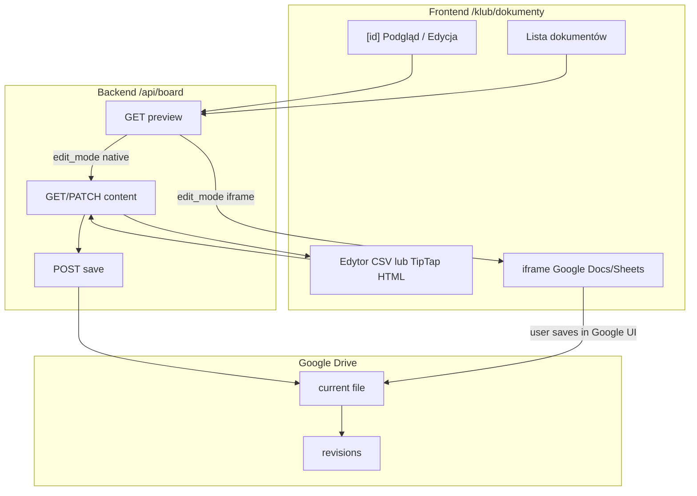
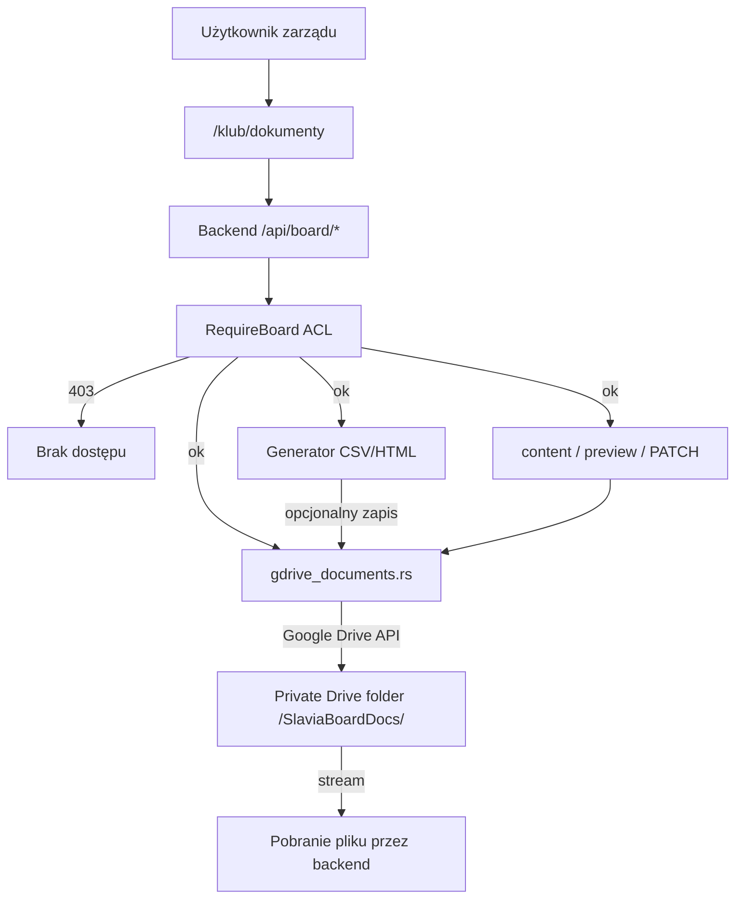

## Założenia (z Twoich odpowiedzi)
- Konto „członka zarządu” ma dostęp do sekcji w panelu klubu (`/klub`), która przechowuje dokumenty klubu i ma generator.
- Są dwa poziomy uprawnień w obrębie zarządu:
  - „prezes/wice” (pełne uprawnienia): może zapisywać/wersjonować dokumenty w repozytorium oraz generować m.in. listy startowe.
  - „pozostali członkowie zarządu”: mogą generować dokumenty podstawowe (np. raporty na zebrania + dokumenty dostępne „dla każdego”), ale bez zapisywania/wersjonowania repozytorium.
- Superadmin: dostęp do wszystkiego.

## Proponowany model techniczny
- W backendzie dodajemy nowe role w JWT/DB, najlepiej jako:
  - rola bazowa: `BoardMember` (członek zarządu)
  - dodatkowa rola/flag (uprawnienie): `BoardDocsFullAccess` (pełne zarządzanie repozytorium i generatorami startowymi)
- Na potrzeby frontendowego panelu dodajemy nowy „panel role” `board` (osobny zestaw modułów w katalogu panelu), ale zabezpieczenia finalnie i tak egzekwujemy po stronie backendu (HTTP 403).

## Backend (Rust)
1. Uprawnienia i middleware
   - Rozszerzamy `Role` o `BoardMember` i `BoardDocsFullAccess` w `[Slavia-backend/src/models.rs](C:/Users/jakub/Desktop/Slavia-backend/src/models.rs)`.
   - Dodajemy middleware/extractory w `[Slavia-backend/src/middleware/auth.rs](C:/Users/jakub/Desktop/Slavia-backend/src/middleware/auth.rs)`:
     - `RequireBoardOrSuperAdmin`
     - `RequireBoardDocsFullAccessOrSuperAdmin`
   - Dla „generatorów startowych” i operacji „zapis do repozytorium/wersjonowanie” używamy wariantu `RequireBoardDocsFullAccessOrSuperAdmin`.
   - Dla „raportów podstawowych” (widoczne dla zarządu bez pełnych uprawnień) używamy `RequireBoardOrSuperAdmin`.

2. Przechowywanie w Google Drive (prywatny folder) — bez nowych tabel SQLite

   **Decyzja:** repozytorium dokumentów zarządu = prywatny folder na Google Drive, do którego dostęp ma tylko backend (konto serwisowe/service account). Backend nigdy nie zwraca bezpośrednich publicznych URL do plików.

   Proponowana struktura w Drive:
   ```
   /SlaviaBoardDocs/ (folder bazowy; private)
     _manifest.json                  # indeks: lista dokumentów + metadane + app_versions + doc_type
     athletes/                       # dokumenty zawodników
     coaches/                        # dokumenty trenerskie
     competitions/                   # zawody (regulaminy, protokoły…)
     start-lists/                    # listy startowe (generator)
     equipment/                      # sprzęt
     meeting-reports/                # raporty / protokoły zarządu (generator)
     organizational/                 # statut, uchwały, regulaminy
     financial/                      # składki, faktury, dotacje
     hr/                             # kadry, BHP
     legal/                          # RODO, ubezpieczenia
     marketing/                      # promocja, wizerunek
     templates/                      # szablony HTML/CSV (szkielet do podglądu i edycji)
     archive/                        # archiwum (opcjonalnie)
   ```

   **Katalog typów dokumentów (V1 — zrobione w prototypie UI):**
   - ~55 wbudowanych typów w `app/data/boardDocumentCatalog.ts` (sport: zawodnicy, trenerzy, zawody, sprzęt; zarząd: organizacyjne, finansowe, kadrowe, prawne, marketing).
   - Strona `/klub/dokumenty/typy` — przegląd katalogu + dodawanie typów własnych (`custom_*`; prototyp: localStorage → docelowo zapis w manifest/API).
   - Pole `doc_type` w `_manifest.json` odnosi się do id typu z katalogu.

   **Wersjonowanie A+B:**
   - natywne `revisions` Drive: przy zapisie „aktualizujemy” plik „current”, przez co Drive tworzy rewizje,
   - historia „app-level versions” w `_manifest.json`: backend inkrementuje `version_no` i dopisuje wpis (kto/ kiedy/ parametry generatora) — to jest to, co UI pokazuje jako „wersje” niezależnie od szczegółów Drive.

   **Bez nowych tabel w SQLite:** cała lista/manifest i mapowanie wersji opieramy o `_manifest.json` w Drive. (SQLite zostaje tylko do logów/audytu, jeśli już istnieje). 

3. Endpoints API (OpenAPI)
   - Dodajemy nowy moduł tras, np. `[Slavia-backend/src/routes/board_documents.rs](C:/Users/jakub/Desktop/Slavia-backend/src/routes/board_documents.rs)` oraz rejestrujemy go w `[Slavia-backend/src/router.rs](C:/Users/jakub/Desktop/Slavia-backend/src/router.rs)`.
   - Proponowane endpointy (proxy do Google Drive + generatory):
     - `GET /api/board/documents` — odczyt `_manifest.json` (`RequireBoardOrSuperAdmin`)
     - `GET /api/board/documents/{id}` — metadane pojedynczego dokumentu + lista wersji app-level
     - `GET /api/board/documents/{id}/content` — pobranie treści bieżącej wersji (stream; `text/csv`, `text/html`, `application/pdf`…)
     - `GET /api/board/documents/{id}/preview` — metadane podglądu: `mime_type`, `edit_mode` (`native` | `iframe` | `download_only`), opcjonalnie `iframe_url` / `webViewLink` (tylko dla uprawnionych; **nigdy** publiczny link bez auth)
     - `PATCH /api/board/documents/{id}/content` — zapis treści po edycji natywnej w Slavii (`RequireBoardDocsFullAccessOrSuperAdmin`); walidacja CSV / `sanitizeRichHtml` dla HTML
     - `POST /api/board/documents/save` — zapis/update „current” w Drive + aktualizacja `_manifest.json` (`RequireBoardDocsFullAccessOrSuperAdmin`)
     - `POST /api/board/documents/delete` — archiwizacja/usunięcie (`RequireBoardDocsFullAccessOrSuperAdmin`)
     - `POST /api/board/documents/generate` — generator w pamięci; opcjonalnie zapis do Drive (zaktualizowanie pliku „current” + nowa app-version w `_manifest.json`)
       - `meeting_report` → `BoardMember` (generuj + pobierz; zapis do repo tylko jeśli `save_to_repo`)
       - `competition_start_list` → `BoardDocsFullAccess` (generuj; zapis domyślnie do `start-lists/` i nowe `version_no`)
     - `GET /api/board/document-types` — lista typów (builtin + custom z manifestu) — opcjonalnie w V2
     - `POST /api/board/document-types` — dodanie typu własnego (prezes/wice) — opcjonalnie w V2
    - `GET /api/system/gdrive-status` — endpoint statusu integracji Google Drive (analogicznie do istniejącego `cms-status` dla mediów)
   - Start listy
     - Bazujemy na istniejących modelach: `competitions`, `competition_participants` i `athletes` (w backendzie już jest `list_participants` w `[Slavia-backend/src/routes/competition_participants.rs](C:/Users/jakub/Desktop/Slavia-backend/src/routes/competition_participants.rs)`), więc generator start list może pobierać listę uczestników i dane zawodników.
   - Raporty na zebrania
     - Zakładamy, że „zebrania” są powiązane z datą (np. jako wydarzenie na kalendarzu / jako sesje obecności). Na bazie tego generator złoży:
       - tabelę obecności (z `attendance_records` dla daty lub zakresu)
       - statystyki (present/absent/pending) — backend już liczy summary per-athlete w `[Slavia-backend/src/routes/attendance.rs](C:/Users/jakub/Desktop/Slavia-backend/src/routes/attendance.rs)`; w tej iteracji dodajemy ewentualnie nową funkcję „summary per date” jeśli będzie potrzebna.

4. Integracja OpenAPI
   - Po dodaniu tras i DTO generujemy snapshot i typy zgodnie z AGENTS: `pnpm openapi:snapshot` + `pnpm openapi:types`.

## Podgląd i edycja dokumentów (Google Drive + Slavia UI)

**Zasada:** klient **nigdy** nie komunikuje się z Google Drive bezpośrednio — tylko przez backend (service account). Podgląd i edycja odbywają się w panelu `/klub/dokumenty`, ale pliki fizycznie leżą na Drive.

### Strategia per format (decyzja produktowa)

| Format | Podgląd szkieletu w aplikacji | Edycja w Slavii | Uwagi |
|--------|------------------------------|-----------------|-------|
| **CSV** (raporty, listy startowe) | Tak — tabela + podgląd surowy | **Tak — natywnie** (edytor tekstu / siatka) | Priorytet V1; generator tworzy szkielet → użytkownik dopina/edytuje → zapis na Drive |
| **HTML** (szablony uchwał, protokoły) | Tak — `SlaviaSafeHtml` | **Tak — natywnie** (TipTap + `sanitizeRichHtml` przy zapisie) | Szablony w `templates/`; szkielet = plik z placeholderami |
| **Tekst / JSON** (`_manifest.json`) | Tak | Tak (edytor kodu, tylko SA/prezes) | Manifest edytowany głównie przez backend |
| **PDF** (licencje PZPC, skany) | Tak — `pdf.js` lub stream z backendu | **Nie inline** — podgląd + „wgraj nową wersję” | Brak sensownego WYSIWYG PDF w przeglądarce |
| **DOCX / XLSX** | Ograniczony podgląd | Raczej poza app lub konwersja | Unikać jako format docelowy szablonów |
| **Google Docs / Sheets / Slides** | Tak — iframe | **Tak — przez iframe Google** | `https://docs.google.com/document/d/{fileId}/edit?embedded=true` (lub Sheets/Slides); UX toolbar Google, ale użytkownik zostaje w Slavii |

### Tryby edycji (`edit_mode` w API preview)

- `native` — treść pobrana przez `GET .../content`, edycja w komponencie Slavii, zapis przez `PATCH .../content`.
- `iframe` — backend zwraca `file_id` Drive + bezpieczny URL embed; frontend renderuje `<iframe>` w `KlubPageShell` / dedykowanym `BoardDocumentEditorFrame.vue`. Edycja = rewizje Drive po stronie Google; Slavia po zamknięciu iframe odświeża manifest / `version_no` (webhook lub ręczne „Zapisano — odśwież wersje”).
- `download_only` — PDF i pliki binarne: podgląd + pobranie + upload nowej wersji (prezes/wice).

### Podgląd szkieletu (szablony)

- Generator lub „Utwórz z szablonu” kopiuje plik z `templates/{doc_type}.html` lub `.csv` do folderu docelowego jako wersja 1.
- UI na `/klub/dokumenty/[id]`: zakładki **Podgląd** | **Edytuj** | **Historia wersji**.
- Podgląd szkieletu przed pierwszym zapisem: generator zwraca blob → modal podglądu → „Zapisz do repozytorium” (pełne uprawnienia).

### Ważne ograniczenia i decyzje techniczne

- **Brak live collaboration** dla CSV/HTML — przy równoległej edycji: pessimistic lock (`locked_by`, `locked_at` w manifeście lub krótki lease w SQLite tylko na lock, nie na treść) albo komunikat o konflikcie wersji przy zapisie.
- **Google Docs API** (programowa zmiana akapitów) — tylko dla automatycznych generatorów, **nie** jako główny edytor ręczny.
- **Bezpieczeństwo HTML:** wyświetlanie przez `SlaviaSafeHtml`; zapis przez `sanitizeRichHtml`; zakaz `v-html` poza whitelistą ESLint.
- **Audyt:** każdy zapis = wpis w `versions[]` (kto, kiedy, `generator_params` lub `edit_source: native|iframe|upload`).
- **ACL:** podgląd tylko dokumentów udostępnionych danej roli; edycja/zapis tylko `BoardDocsFullAccess` + SuperAdmin (zgodnie z założeniami uprawnień).



## Frontend (Nuxt)

1. Rola i bramka w `useAuth`
   - Rozszerzamy typy `UserRole` w `[Slavia-frontend/app/types/models.ts](C:/Users/jakub/Desktop/Slavia-frontend/app/types/models.ts)` o nowe role.
   - W `[Slavia-frontend/app/composables/useAuth.ts](C:/Users/jakub/Desktop/Slavia-frontend/app/composables/useAuth.ts)` dodajemy computed flags:
     - `isBoardMember`
     - `isBoardDocsFullAccess`

2. Nowa „panel role” w katalogu modułów
   - W `[Slavia-frontend/app/data/panelNavigationCatalog.ts](C:/Users/jakub/Desktop/Slavia-frontend/app/data/panelNavigationCatalog.ts)`:
     - dodajemy `PanelNavRole = 'admin' | 'trainer' | 'athlete' | 'board'`
     - dodajemy nowe moduły z flagami `panel_nav_board_*` dla URL w ramach `/klub`, np.:
       - `/klub/dokumenty` (repozytorium)
       - `/klub/dokumenty/generator` (generator)
       - `/klub/dokumenty/typy` (katalog typów dokumentów)
     - moduły oznaczamy `gateRoute: true` dla elementów, które mają być blokowane po wyłączeniu flag.
   - Aktualizujemy `rolesForUserRoles` i logikę mapowania w `[Slavia-frontend/app/composables/usePanelNavigationFlags.ts](C:/Users/jakub/Desktop/Slavia-frontend/app/composables/usePanelNavigationFlags.ts)` (funkcja `userHasRole` oraz `panelNavRolesForUserRoles`).

3. `/klub` jako hub dla zarządu
   - W `[Slavia-frontend/app/composables/useKlubDashboardNav.ts](C:/Users/jakub/Desktop/Slavia-frontend/app/composables/useKlubDashboardNav.ts)` dodajemy logikę `panelRole` dla zarządu.
   - W `[Slavia-frontend/app/pages/klub/index.vue](C:/Users/jakub/Desktop/Slavia-frontend/app/pages/klub/index.vue)` nic fundamentalnego, ale efektem będzie to, że pojawią się nowe grupy modułów dla roli `board`.

4. Strony UI dla dokumentów i generatorów
   - **Stan prototypu (zrobione):** `klub/dokumenty/index.vue`, `generator.vue`, `typy.vue`, `[id].vue`; mock manifest; katalog typów; flaga `board_documents_prototype`.
   - **Do zrobienia po backendzie:**
     - `klub/dokumenty/[id].vue` — rozszerzyć o zakładki Podgląd | Edytuj | Wersje
     - `BoardDocumentPreview.vue` — CSV (tabela), HTML (`SlaviaSafeHtml`), PDF (`pdf.js`)
     - `BoardDocumentNativeEditor.vue` — CSV textarea / siatka; HTML TipTap
     - `BoardDocumentEditorFrame.vue` — iframe Google Docs/Sheets (`edit_mode: iframe`)
   - Komponenty:
     - wykorzystujemy istniejące layouty panelowe (`KlubPageShell`, `PanelPageLayout`) oraz zasady safe rendering (`SlaviaSafeHtml`, sanityzacja przy zapisie).
   - Komunikacja:
     - composable `useBoardDocuments` — manifest, `fetchContent`, `saveContent`, `getPreviewMeta`
     - composable `useBoardDocumentGenerator` — generatory + podgląd szkieletu przed zapisem
     - composable `useBoardDocumentTypes` — już w prototypie; docelowo sync z API
   - Status storage: `GET /api/system/gdrive-status` przed zapisem (analogicznie do `cms-status`)

5. Superadmin: zarządzanie flagami modułów
   - W `[Slavia-frontend/app/pages/superadmin/nawigacja-paneli.vue](C:/Users/jakub/Desktop/Slavia-frontend/app/pages/superadmin/nawigacja-paneli.vue)` dodajemy tab dla `board` do konfiguracji `panel_nav_board_*`.

## Proponowane „przydatne narzędzia” dla zarządu w `/klub` (V1)
- Panel dokumentów:
  - szybki dostęp do repozytorium + filtry po domenie/kategorii/typie
  - lista ostatnich dokumentów z podglądem typu z katalogu
- Generator:
  - listy startowe (CSV) — pełne uprawnienia + zapis do repo
  - raport na zebranie (CSV) — podstawowe uprawnienia; zapis opcjonalny
  - **podgląd szkieletu** przed zapisem do Drive
- Edycja i szablony:
  - szablony HTML/CSV w `templates/` — podgląd i edycja natywna w Slavii
  - dokumenty Google Docs/Sheets — edycja przez **iframe** w panelu
  - PDF — podgląd + wgranie nowej wersji
- Katalog typów (`/klub/dokumenty/typy`):
  - 55+ znanych rodzajów dokumentów klubu
  - typy własne (prezes/wice)

## Plan wdrożenia etapami
- **Etap 1:** role + Google Drive + endpointy manifest/list/download + UI listy + generator raportów (pobranie bez zapisu) + status `gdrive-status`
- **Etap 2:** zapis na Drive, revisions + app-version w `_manifest.json`, listy startowe dla prezes/wice, **podgląd treści** (`GET content/preview`)
- **Etap 3:** **edycja natywna** CSV/HTML w aplikacji (`PATCH content`), szablony w `templates/`, podgląd szkieletu z generatora
- **Etap 4:** **edycja przez iframe** Google Docs/Sheets, typy własne przez API, lock wersji / konflikty, panel nav `board` + SuperAdmin flagi

## Mermaid — przepływ danych (Google Drive)


## Wymagania środowiskowe (deploy)
- Dostęp dla backendu do prywatnego folderu na Google Drive:
  - `SLAVIA_BOARD_GDRIVE_ROOT_FOLDER_ID` (ID folderu bazowego)
  - `SLAVIA_BOARD_GDRIVE_SERVICE_ACCOUNT_JSON` (JSON key service account) lub ustawienie przez `GOOGLE_APPLICATION_CREDENTIALS`
  - opcjonalnie: `SLAVIA_BOARD_GDRIVE_APP_NAME` / `SLAVIA_BOARD_GDRIVE_TEMPLATE_FOLDER_ID` jeśli nie chcemy polegać na rekurencji po nazwach.
- W folderze Drive utworzyć `/SlaviaBoardDocs/` + początkowy `_manifest.json` (np. `{ "documents": [] }` lub `[ ]` zależnie od finalnego formatu).

## Kryteria akceptacji (minimum)
- Użytkownik z rolą „członek zarządu” widzi moduł dokumentów w `/klub` i może generować raporty podstawowe (pobranie pliku + **podgląd szkieletu**).
- Użytkownik z pełnymi uprawnieniami (prezes/wice) może aktualizować dokumenty na Google Drive, **edytować CSV/HTML w aplikacji** oraz otwierać **Google Docs/Sheets w iframe**; przegląda historię wersji (Drive revisions + app-level versions).
- Dokumenty nie trafiają do SQLite — źródło prawdy to pliki w prywatnym folderze Google Drive (+ ewentualnie lekki lock w SQLite, nie treść).
- Klient nie otrzymuje publicznych URL Drive — wyłącznie stream/proxy przez backend.
- Przy braku poprawnej konfiguracji Google Drive backend zwraca czytelny błąd.
- Zablokowane operacje → `403` z backendu.
- Superadmin: pełny dostęp + flagi `panel_nav_board_*`.
- HTML: wyświetlanie i zapis zgodnie z zasadami XSS (`SlaviaSafeHtml`, `sanitizeRichHtml`).
- OpenAPI snapshot i typy frontendu bez driftu.
