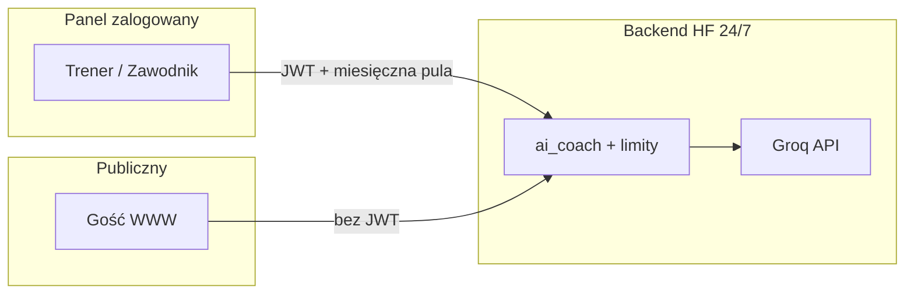

# TODO — funkcje AI (gałąź `feature/AI`)

> **Ostatnia aktualizacja:** 2026-06-22  
> **Architektura:** Frontend Vercel ↔ Backend Hugging Face (`koliber-cks-slavia.hf.space`), bezpośrednie wywołania AI (bez BFF Nuxt)  
> **Provider:** Groq (LLM + vision) · **Mobile:** tylko zawodnik/trener (parity panelowych trybów AI)

---

## Status fundamentu AI (`feature/AI`)

| Element | Stan |
|---------|------|
| Komunikacja panelowa | ✅ `useApi()` → Rust `/api/ai/coach/*` + JWT |
| Asystent publiczny WWW | ✅ `useBackendDirectUrl()` → `/api/ai/coach/public/*` |
| Miesięczna pula klubu (panel) | ✅ `ai_coach_monthly.rs` + licznik w `system_settings` |
| Limit edytowalny z devtools | ✅ `monthly_limit` w `ai_coach_settings` (domyślnie 300) |
| Publiczny AI przy wyczerpaniu puli | ✅ działa dalej; panel wyłączony do odnowienia miesiąca |
| Prompty / temperatury SA | ✅ `/superadmin/developer` → Studio promptów |
| Streaming LLM | 🔴 stub SSE — backlog |
| Mobile Trener AI | 🔴 brak parity (MOB-P2) |

### Commity lokalne (feature/AI)

| Repo | Commit | Opis |
|------|--------|------|
| **Backend** | `19becbd` | Miesięczna pula + konfiguracja w settings API |
| **Frontend** | `d3ffc4f` | Bezpośredni backend zamiast BFF AI |
| **Frontend** | `1c38308` | UI limitów miesięcznych (panel + devtools) |

---

## Zasady na nowe funkcje AI

1. **Jeden provider, wiele trybów** — rozszerzaj `mode` w `POST /api/ai/coach/chat` (jak `plan`, `recovery`, `barbell_path`), zamiast osobnego mikroserwisu na każdą funkcję.
2. **Kontekst z bazy** — AI dostaje tylko to, co backend już wie (dziennik, wyniki, plan, obecność). Kadra: ACL jak przy `athlete_id` (wątek czatu trenera).
3. **Structured output** — gdy wynik trafia do UI/DB: JSON + walidacja schematu w Rust przed zapisem.
4. **Limity warstwami** — miesięczna pula klubu (panel) · minutowe/dobowe (anti-abuse) · publiczne osobno.
5. **Prompt jako konfiguracja** — nowy tryb = `mode_*_hint` w devtools + domyślny prompt w `ai_coach.rs`.
6. **Mobile** — tylko zawodnik/trener; ten sam endpoint i kontrakt JSON, bez duplikacji logiki we Flutterze.
7. **Bez BFF Nuxt dla AI** — wyłącznie frontend → Rust (CORS na HF).



---

## Fala 0 — dokończyć fundament (przed nowymi trybami)

- [ ] Merge `feature/AI` → `main` (backend HF, potem frontend Vercel)
- [ ] E2E happy-path: logowanie → `/trainer/ai-coach` lub `/athlete/ai-coach` → status + jedna wiadomość (mock Groq lub staging)
- [ ] Mobile: ekran Trenera AI (`MOB-P2`) — ten sam API co WWW
- [ ] OpenAPI: pola quota (`club_*_month`) + `monthly_limit` w settings
- [ ] Devtools: opcjonalny wykres zużycia miesięcznego (tylko odczyt z API)

---

## Fala A — szybkie wygrane (2–4 tyg.)

| ID | Funkcja | Dla kogo | Opis | Tryb / API |
|----|---------|----------|------|------------|
| A-1 | Podsumowanie tygodnia | Zawodnik | „Co zrobiłem, co zaplanowane, 1–2 wskazówki” z dziennika + kalendarza | `mode: week_summary` |
| A-2 | Wyjaśnienie wyniku | Zawodnik / publiczny | Krótki komentarz przy profilu: trend Sinclair, ostatnie starty | kontekst public + cache lub chat |
| A-3 | Szkic ogłoszenia | Admin (WWW) | Z bulletów → `SlaviaSimpleMarkdown` do edycji | `mode: announcement_draft` |
| A-4 | Recovery z kontekstem | Zawodnik | Rozszerzyć `recovery` o sen/RPE z dziennika | istniejący tryb + `fetch_*_context` |
| A-5 | Eskalacja do trenera | Public AI | Gdy pytanie wymaga człowieka → link `/klub/czat` | prompt + przycisk w `ClubPublicAiAssistant` |

### Checklist per funkcja (A-*)

- [ ] **A-1** Backend: `fetch_week_summary_context()`, prompt, limit miesięczny
- [ ] **A-1** Frontend: akcja na dashboardzie zawodnika lub w `ai-coach`
- [ ] **A-1** Mobile: ten sam endpoint
- [ ] **A-2** Backend: kontekst tylko danych publicznych (bez PII spoza profilu)
- [ ] **A-3** Backend: JSON/markdown → walidacja przed zwrotem
- [ ] **A-3** Frontend: przycisk w hubie ogłoszeń admina
- [ ] **A-4** Backend: rozszerzyć kontekst zawodnika o ostatnie wpisy recovery
- [ ] **A-5** Frontend: warunek w UI + copy PL

---

## Fala B — średnia złożoność (1–2 mies.)

| ID | Funkcja | Dla kogo | Opis |
|----|---------|----------|------|
| B-1 | Import wyników ze zdjęcia | Kadra | Zdjęcie protokołu / tekst → propozycja wpisów `results` (człowiek zatwierdza) |
| B-2 | Plan tygodniowy z kontekstu | Trener | Plan z obecności, wyników, kontuzji → import `training_plans` |
| B-3 | Analiza obecności | Trener | „Kto zaniedbuje treningi” — LLM + agregaty SQL |
| B-4 | Tor sztangi v2 | Zawodnik/trener | Cue techniczne + porównanie z poprzednimi nagraniami (historia DB) |
| B-5 | Asystent CMS | Admin | Pomoc przy treści stron (bez auto-publish) |

- [ ] **B-1** Vision pipeline (reuse `invoke_llm_with_attachments`)
- [ ] **B-1** UI: podgląd propozycji + batch approve
- [ ] **B-2** Rozszerzyć import planu o bogatszy kontekst kadry
- [ ] **B-3** Endpoint tylko kadra; bez auto-wysyłki powiadomień
- [ ] **B-4** Tabela historii analiz toru per zawodnik
- [ ] **B-5** Tryb tylko SuperAdmin/Admin; sanityzacja jak CMS

---

## Fala C — większe inwestycje

| ID | Funkcja | Uwagi |
|----|---------|--------|
| C-1 | RAG po dokumentach klubu | Regulamin, FAQ — embeddingi + wyszukiwanie; sensowne przy dużej bazie wiedzy |
| C-2 | Powiadomienia proaktywne | Cron na HF: brak logów treningu → szkic wiadomości dla trenera |
| C-3 | Głos / transkrypcja | Dyktowanie wpisu dziennika (Whisper lub inny provider) |
| C-4 | Streaming odpowiedzi | Pełny SSE z Groq; dziś stub — UX, nie priorytet przy limitach tokenów |
| C-5 | Tier puli miesięcznej | Np. public 50 + panel 250 zamiast jednego licznika |

---

## Checklist techniczny — nowa funkcja AI

```
1. Backend (Rust)
   ├── mode w ai_coach.rs (+ opcjonalny hint w ai_coach_settings)
   ├── fetch_*_context() z DB + ACL
   ├── enforce_authenticated_ai_monthly() dla panelu
   ├── walidacja JSON przed zapisem (jeśli mutacja)
   └── router.rs + OpenAPI embed

2. Frontend (Nuxt)
   ├── composable useXxxAi.ts (status, blockedReason, quota)
   ├── komponent lub akcja w istniejącym ekranie
   ├── SlaviaChatMarkdown / SlaviaSafeHtml do wyświetlania
   └── useExperimentalFlag() przy rollout stopniowym

3. Mobile (Flutter) — jeśli panel zawodnik/trener
   └── ten sam endpoint, ten sam kontrakt JSON

4. Devtools
   └── hint trybu + dokumentacja w Ops
```

**Pliki referencyjne:** `ai_coach.rs`, `ai_coach_monthly.rs`, `ai_coach_settings.rs`, `useOlympicCoachAi.ts`, `DeveloperAiCoachSettings.vue`, `post_throttle.rs`

---

## Koszt i jakość

| Mechanizm | Stan | Propozycja |
|-----------|------|------------|
| Limit miesięczny klubu | ✅ devtools | Dostosować pod budżet Groq po pierwszym miesiącu prod |
| Limity burst (min/dzień) | ✅ `post_throttle` | Bez zmian |
| Kill switch | ✅ flaga `olympic_coach` | Nowe tryby — osobne flagi eksperymentalne |
| Monitoring zużycia | 🟡 tylko licznik | Wykres w devtools + opcjonalny alert przy 80% |
| Jakość promptów | 🟡 | Wektory testowe (jak `test-vectors` w shared) |
| PII / logi | ✅ `is_ai_content_path` | Bez logowania treści żądań AI |
| Parser MD | 🟡 niepełny | Vitest rozszerzyć przy nowych formatach LLM |

---

## Czego nie robić na start

- Własny fine-tuning modelu — Groq + prompty + kontekst z DB wystarczą.
- AI w panelach Admin/SA poza devtools i szkicami CMS (mobile ich nie ma).
- Auto-zapis bez review człowieka (plany, wyniki, ogłoszenia).
- Wiele providerów równolegle (OpenAI + Groq + …) — jeden Groq + fallback modelu.
- Powrót do BFF Nuxt dla AI.
- Duplikacja limitów i promptów we Flutterze.

---

## Sugerowana kolejność prac

1. **Merge `feature/AI`** + deploy HF → Vercel + smoke
2. **A-1** Podsumowanie tygodnia (zawodnik) — pierwszy nowy tryb, małe ryzyko
3. **Mobile parity** Trenera AI
4. **B-1** Import wyników ze zdjęcia (naturalne rozszerzenie vision)
5. **C-1 / C-2** dopiero przy stabilnym zużyciu i feedbacku z fal A–B

---

## Komendy pomocnicze (PowerShell)

```powershell
# Gałąź feature/AI
cd C:\Users\jakub\Desktop\Slavia-frontend; git checkout feature/AI; git log -5 --oneline
cd C:\Users\jakub\Desktop\Slavia-backend;  git checkout feature/AI; git log -5 --oneline

# Walidacja
cd C:\Users\jakub\Desktop\Slavia-frontend
pnpm typecheck
pnpm test
pnpm lint

cd C:\Users\jakub\Desktop\Slavia-backend
cargo test ai_coach

# Smoke backend AI (publiczny status)
cd C:\Users\jakub\Desktop\Slavia-frontend
pnpm smoke:backend
# lub: GET https://koliber-cks-slavia.hf.space/api/ai/coach/public/status
```

---

## Notatki

- Szczegółowy audyt modułu AI: `improve.md` §5, `BE-AI*`, `AI-K*`
- Deploy: `docs/deploy-hf-vercel.md`
- Agenci: `AGENTS.md` — commity po angielsku, bez `Co-authored-by`
